
  

    
This content is sourced from "Computernetzwerke und Verteilte Systeme" by TU Darmstadt, written by Prof. Dr. Max Mühlhäuser.

    
Here you'll find just a summary from a student that could be wrong. Only for personal education usage.

 
  

# Queueing Theory: An Introduction

Queueing theory is a branch of mathematics that deals with the study of waiting lines, or queues. It provides mathematical models to predict queue lengths and waiting times in various systems. In this article, we will explore the fundamentals of queueing systems and their relevance in network theory.

## Arrival Process

The arrival process in a queueing system refers to how customers enter the system over time. It is described by the distribution of interarrival times, which is the time between the arrivals of two successive customers or jobs. For example, when waiting for a bus, the arrival process represents the probability that the time between two buses is less than or equal to a certain duration.

The probability distribution function for the interarrival time is denoted as A(t) and can be defined as:

$$ A(t) = P(\text{time between arrivals} \leq t)$$
For instance, in the bus example, if A(10) = 0.8, it means there is an 80% chance that the time between two buses is less than or equal to 10 minutes.

## Service Process

The service process in a queueing system determines how much demand each request generates. It is characterized by the service time, which is the time required to serve a customer or complete a request after its arrival. The service time is described by its distribution function. 

The probability distribution function for the service time is denoted as B(x) and can be defined as:

$$B(x) = P(\text{service time} \leq x)$$

## Queue Length and Number of Servers

Two important factors in queueing systems are the number of places in the queue and the number of servers available to process the requests. The queue length represents the number of customers waiting in the queue at a given time. The number of servers determines how many requests can be served simultaneously. These factors significantly impact the waiting time for customers and the overall system performance.

## Queueing Disciplines

Queueing systems employ different strategies, known as queueing disciplines, to process the queues. These disciplines determine the order in which customers are served. Common queueing disciplines include First-Come-First-Served (FCFS), where customers are served in the order of their arrival, and Priority Queueing, where customers with higher priority are served first. The choice of queueing discipline depends on the specific requirements and priorities of the system.

## Metrics and Notations
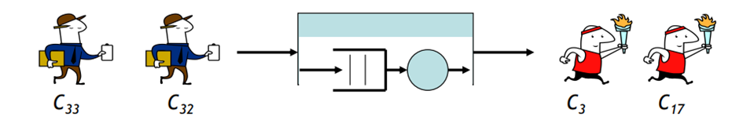
In queueing theory, various metrics are used to measure the performance of queueing systems. These include waiting time for customers, number of customers in the system, backlog (undone work), and system utilization. Several notations are also used to represent different variables and parameters in queueing theory:

1. $$C_n$$ denotes the nth customer to enter the system.
2. $$\alpha(t)$$ represents the number of arrivals in the interval $$[0, t)$$.
3. $$\delta(t)$$ represents the number of departures in the interval $$[0, t)$$.
4. $$N(t)$$ represents the number of customers in the system at time $$t$$, calculated as $$N(t) = \alpha(t) - \delta(t)$$.
5. $$\tau_n$$ is the arrival time of customer $$C_n$$.
6. $$t_n$$ is the interarrival time between $$C_n$$ and $$C_{n-1}$$, given by $$t_n = \tau_n - \tau_{n-1}$$. The probability that $$t_n$$ is less than or equal to a certain duration is denoted by $$A(t)$$. It is also common to use the notation $$\overline{t}$$ to represent the average interarrival time between customers, with the special notation $$\overline{t} = \frac{1}{\lambda}$$, where $$\lambda$$ represents the average arrival rate. Common notation: Arrival rate = $$\lambda$$ ($$\lambda = \lim_{t \to \infty} \frac{\alpha(t)}{t} $$).
7. $$x_n$$ represents the service time for $$C_n$$. The probability that $$x_n$$ is less than or equal to a certain duration is denoted by $$B(x)$$. It is common to use the notation $$\overline{x}$$ to represent the average service time, with the special notation $$\overline{x} = \frac{1}{\mu}$$, where $$\mu$$ represents the average service rate. Common notation: Service rate = $$\mu$$.
8. $$w_n$$ represents the waiting time in the queue for $$C_n$$.
9. $$s_n$$ represents the system time for $$C_n$$, given by $$s_n = w_n + x_n$$.
10. $$\overline{w} = W$$ represents the average waiting time, and $$\overline{s} = T$$ represents the average total time per customer.
  
- Numbers of customers in sytem at t N(t) = $$\alpha(t) - \delta(t)$$
- Total time customers spent in the system: $$\gamma(t)=\sum_{i=s}^{o(t)}T(i)$$
- Can also be derived with $$:\gamma(t)=\int_{0}^{t}N(\tau)d\tau\ \ ,$$
- Average system time per customer:  $$ {\mathsf{T}}_{\mathfrak{t}}=\gamma({\mathfrak{t}})/\alpha({\mathfrak{t}})$$
- **N = $$\lambda * T$$ (Little's law)** if $$\lambda =$$ average arrival rate and $$\lim_{t \to \infty} T_t = T$$ exists
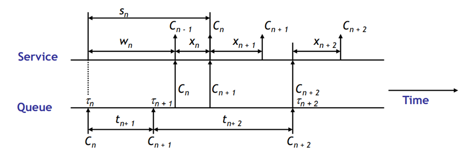

**Utilization Factor:**

The utilization factor $$\rho$$ is defined as the ratio of the arrival rate $$\lambda$$ to the service rate $$\mu$$:

$$\rho = \frac{\lambda}{\mu} = \lambda * \overline{x}$$

The utilization factor indicates the level of system utilization and can range from 0 to 1.

These metrics and notations help in analyzing queueing systems and understanding their performance characteristics. By applying queueing theory, we can optimize resource allocation, improve service efficiency, and enhance customer satisfaction in various domains.

# Stochastic Processes

In reality, many processes exhibit a significant degree of randomness. These processes can be effectively described and analyzed using stochastic processes. A stochastic process is a family of random variables, denoted as X(t), where each variable is indexed by time.

Stochastic processes can be classified based on various characteristics:

1. State Space: The state space represents the possible values that the random variable X(t) can take. It can be either discrete or continuous. A discrete state space is referred to as a chain, while a continuous state space allows for a more extensive range of values.

2. Time Parameter: The time parameter determines whether the stochastic process is discrete or continuous in time. In discrete-time processes, denoted as X(t) = Xn, changes occur only at specific time points. On the other hand, continuous-time processes allow for changes to happen continuously over time.

3. Dependence between X(t)'s: The probabilities associated with a stochastic process may depend on the previous states. The order of dependence is indicated by the conditional probability of X(tn+1) given X(tn), X(tn-1), ..., X(t1). A stochastic process is said to exhibit Markovian dependence if the probability of the next state, X(tn+1), depends only on the current state, X(tn), and not on the preceding states.

Other classes of stochastic processes include:

- Stationary Process: A stationary process remains invariant to shifts in time. The distribution function of X(t) at any time t + τ is the same as the distribution function at time t.

- Independent Process: An independent process implies that X(t) is independent of all previous states. In continuous-time processes, independence is equivalent to white noise.

- Random Walk: A random walk represents a chain of random movements, where the new position is determined by adding a random variable to the previous position. It is commonly used to model particle movements in space.

- Renewal Process: A renewal process is similar to a random walk but focuses on counting transitions rather than the state itself. For example, it can describe the number of machines that need replacement within a given time period.

## Markov Process

A Markov process is a type of stochastic process with a discrete state space. It is considered Markovian if the next state, X(tn+1), only depends on the current state, X(tn), and not on preceding states such as X(tn-1), X(tn-2), and so on. The first-order dependence is expressed as:

$$P[X(tn+1) \leq xn+1 | X(tn) = xn, \ldots, X(t1) = x1] = P[X(tn+1) \leq xn+1 | X(tn) = xn]$$

A Markov chain is a specific type of Markov process, characterized by the fact that predictions about future developments can be made solely based on limited historical information, without the need for the entire history of the process.

Markov processes have additional requirements, including:

- Homogeneity: The state transition probabilities do not depend on time. For example, in weather forecasting, homogeneity means that the probability of transitioning from "Sunny" to "Rainy" remains the same regardless of the observation time.

- Memorylessness: The next state does not depend on the time spent in the current state. In a memoryless Markov process, the probability of transitioning to the next state is independent of the number of previous transitions. For instance, in a coin toss game, the probability of transitioning from "Heads" to "Tails" remains constant, regardless of the number of previous tosses.

- Exponential Distribution: The exponential distribution is
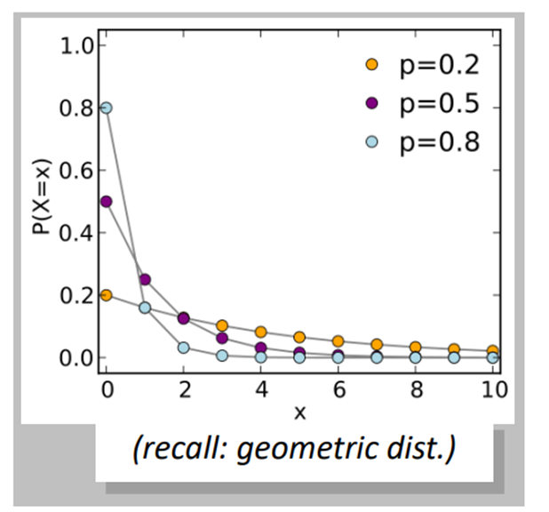
 often employed to model inter-arrival times or waiting times in a Markov process. It possesses memoryless properties, making it a suitable choice for processes with no dependence on the time spent in a particular state.

Stochastic processes and, particularly, Markov processes provide valuable tools for modeling and analyzing various systems with inherent randomness. By understanding the characteristics of these processes, researchers can gain insights into the behavior of complex systems and make informed decisions in diverse fields such as finance, telecommunications, and operations research.

---

## Birth-Death Process

The birth-death process is a special case of a Markov process where the state transitions only occur between neighboring states. For example, if the process involves integers representing the population size, the next state can be either k-1, k, or k+1.

In this process, a transition from state k to k+1 is considered a birth, while a transition from k to k-1 is considered a death. The birth rate λ_k represents the rate at which births occur in a population of size k, and the death rate µ_k represents the rate at which deaths occur in a population of size k.

A process is considered a birth-death process if the following conditions are met:

1. The process is a homogeneous Markov chain X(t) with states 0, 1, 2, and so on.
   - Homogeneous implies that the birth and death rates are independent of time.

2. Births and deaths are independent events.

In the birth-death process, the probabilities of births, deaths, and no events occurring in a small time interval (t, t+∆t) given the population size k are as follows:

- P[1 birth in (t, t+∆t) | k in pop.] = λ_k∆t + o(∆t)
- P[1 death in (t, t+∆t) | k in pop.] = µ_k∆t + o(∆t)
- P[no birth nor death in (t, t+∆t) | k in pop.] = 1 - (λ_k+µ_k)∆t + o(∆t)

Note: The probabilities of multiple births and deaths or simultaneous events are of order o(∆t), which approaches zero as ∆t becomes infinitesimally small (point processes).

To determine the state of the process at time t + ∆t, given that it was in state k at time t, we can use the following equation:

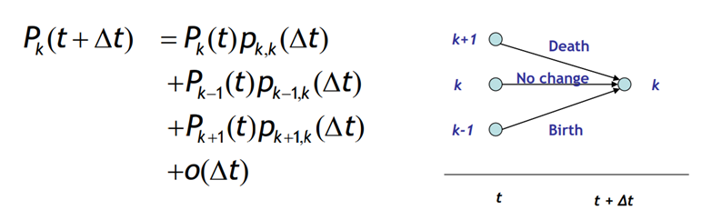
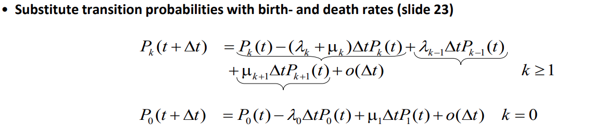
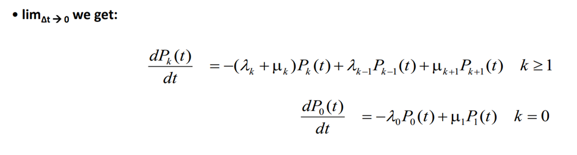

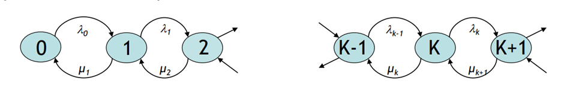

Equilibrium in the birth-death process is achieved when the flow rate into state k is equal to the flow rate out of state k. The flow rate in and out of state k are given by the following formulas:

- Flow rate in = λ_k-1 * P_k-1(t) + µ_k+1 * P_k+1(t)
- Flow rate out = (λ_k + µ_k) * P_k(t)

In the transient phase, the difference between the flow rate in and out represents the effective probability flow rate into state k, which is equivalent to the time derivative of P_k(t) (same as the previous slide).

Understanding the birth-death process and its equilibrium conditions allows us to analyze the probabilities and flow rates within the system. By applying these concepts, researchers and practitioners can gain insights into population models, queuing systems, and various other domains.

**Poisson Processes**
Poisson Process: A Poisson process is a mathematical model used to
describe the occurrence of events over a continuous interval of time or
space. It is characterized by the following properties:

1.  Events occur randomly and independently of each other.

2.  The average rate at which events occur is constant.

3.  Two or more events cannot happen at the same instant.

4.  The number of events that occur within a given interval follows a
    Poisson distribution.

In simpler terms, a Poisson process models situations where events
happen randomly over time, but at an average rate that remains constant.
For example, it could be used to model the arrival of customers at a
store, the occurrence of phone calls at a call center, or the arrival of
vehicles at a toll booth.

Difference between Poisson Process and Markov Process: While both
processes deal with the occurrence of events over time, the key
difference lies in their underlying assumptions and characteristics:

1.  Independence: In a Poisson process, the events are assumed to occur
    independently of each other. However, in a Markov process, the
    probability of transitioning from one state to another depends only
    on the current state, regardless of the past history. Markov
    processes do not necessarily require independence between events.

2.  Event Generation: A Poisson process focuses on the timing of events,
    with a constant average rate. On the other hand, a Markov process
    focuses on the sequence of states or events, where transitions
    between states are probabilistic and memoryless.

3.  State Space: In a Poisson process, the state space is often
    continuous, representing the time or space where events occur. In
    contrast, a Markov process can have a discrete or continuous state
    space, depending on the application.

A Poisson process can be for example a specific type of birth-death process where the death rate µk is 0 for all k and the birth rate λk is constant and equal to λ for all k. In this process, the states represent the number of occurrences or arrivals in a given time interval.

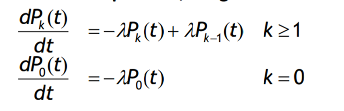

Assuming we start in state 0 with P0(0) = 1 and Pk(0) = 0 for k ≠ 0, we can solve for P0(t) and find that P0(t) = e^(-λt). Inserting this into the equation, we obtain P1(t) = λte^(-λt).

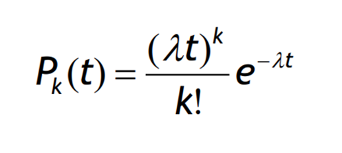

The Poisson process is commonly used to model the arrival of customers in queuing systems. It is characterized by the following properties:

- The average number of arrivals in a time interval t is E[k] = λt.
- The variance of the number of arrivals is equal to λt.
- The process is memoryless, and the inter-arrival times between customers in a Poisson process follow an exponential distribution.

When merging n Poisson processes, each with parameters λ1, λ2, ..., λn, the resulting process is also a Poisson process with a parameter λ' equal to the sum of the individual parameters: λ' = λ1 + λ2 + ... + λn.

In the long run, as t approaches infinity, the probability of finding the system in state k, denoted as pk, reaches a steady state:

lim(t→∞) Pk(t) = pk

The equilibrium equations for the Poisson process can be expressed as follows:

- Flow into state k = λk-1 * pk-1 + µk+1 * pk+1
- Flow out of state k = (λk + µk) * pk

In equilibrium, the flow into state k is equal to the flow out of state k:

λk-1 * pk-1 + µk+1 * pk+1 = (λk + µk) * pk

Notation is simplified for k < 0, as λ, µ, and pk are all 0.

The Poisson process provides a useful framework for analyzing arrival processes and can be applied to various fields where the occurrence of events follows a random and independent pattern.

# M/M/1 Queuing System
A/S/m/N/K/SD
In queuing theory, an M/M/1 queue refers to a specific type of queuing system with one server and a Markovian arrival and service process. The notation M/M/1 represents the characteristics of the queuing system:

- A: Arrival process
- S: Service process
- m: Number of servers (in this case, 1)
- N: Places in the system (bound queue length). If not specified, it is assumed to be infinity.
- K: Population size
- SD: Queue discipline (usually FCFS - First Come First Serve)

For the arrival (A) and service (S) processes, the M notation is used to indicate that they follow an exponential distribution. In an M/M/1 queue, arrivals are modeled as a Poisson process, and service times are exponentially distributed.

Other notations that can be used include D for deterministic and G for general.

## M/M/1 Queue Analysis

Let's explore some key aspects and formulas related to the M/M/1 queuing system:

### Steady State Probabilities

The steady-state probabilities of finding the system with k customers, denoted as pk, can be calculated using the following formula:

pk = p0 * (λ/μ)^k

Here:
- p0 represents the probability of the system being empty.
- λ is the arrival rate.
- μ is the service rate.
- k represents the number of customers in the system.

To ensure the stability of the system, the condition λ < μ (ρ = λ/μ < 1) must hold.

### Average Number of Customers in the System

The average number of customers in the system, denoted as 𝑁̅ (N-bar), can be calculated using the following formula:

𝑁̅ = ρ / (1 - ρ) = λ / (μ - λ)

Here:
- ρ is the utilization factor (ρ = λ/μ).
- μ is the service rate.

### Average Time Spent in the System

The average time a customer spends in the system, denoted as T, can be calculated using the following formula:

T = 1 / (μ - λ)

### Stability and Utilization

If the utilization factor (ρ) reaches 1, the system becomes unstable. This occurs when the arrival rate (λ) is equal to or greater than the service rate (μ). In such cases, the queue length will tend towards infinity.

### Utilization Example

The following diagram illustrates the relationship between the utilization factor (ρ) and the average number of customers in the system (𝑁̅):

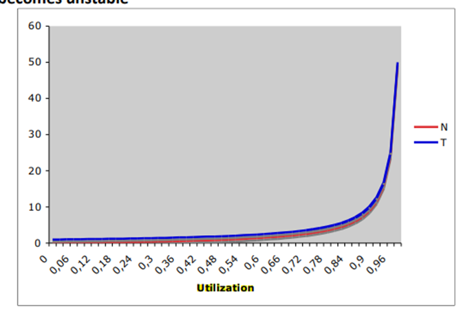

In the long run, the utilization factor determines the average number of customers in the system.

### Deterministic Systems

Deterministic systems can run as long as the utilization factor (ρ) is less than or equal to 1. In such cases, there is no queuing, and everything works smoothly.

### M/M/m Queues

In an M/M/m queue, the system has m servers. If any server is idle, a new request is served immediately. If all servers are busy, the new request must wait. The stability condition for an M/M/m queue is ρ = λ/(mμ) < 1.

The arrival and service coefficients for an M/M/m queue are as follows:

- λₖ = λ, for k = 0, 1, 2, ...
- μₖ = min(kμ, mμ), where μ is the service rate.

The probability of queuing in an M/M/m queue, denoted as δ, can be calculated using Erlang's C formula:

$$\

delta = P(\text{queuing}) = p_0 * \frac{(m * \mathcal{p})^m}{m!(1-\mathcal{p})}$$

where p₀ is the probability of the system being empty, and ρ = λ/μ is the utilization factor.

## Conclusion

The M/M/1 queuing system and its variations, such as the M/M/m queue, are important models in queuing theory. They provide insights into the behavior of systems with random arrivals and service times. By analyzing steady-state probabilities, average number of customers, and average time spent in the system, we can better understand and optimize queuing systems in various real-world scenarios.
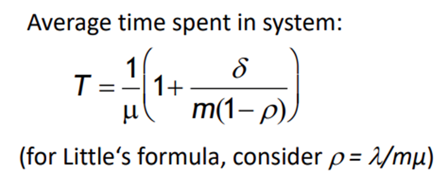
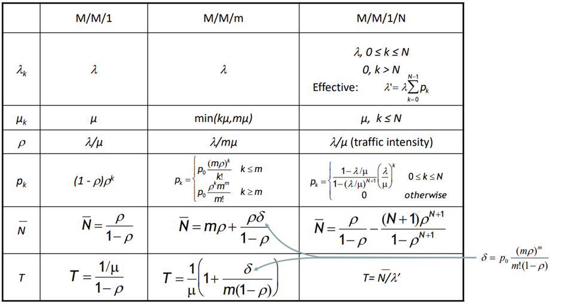